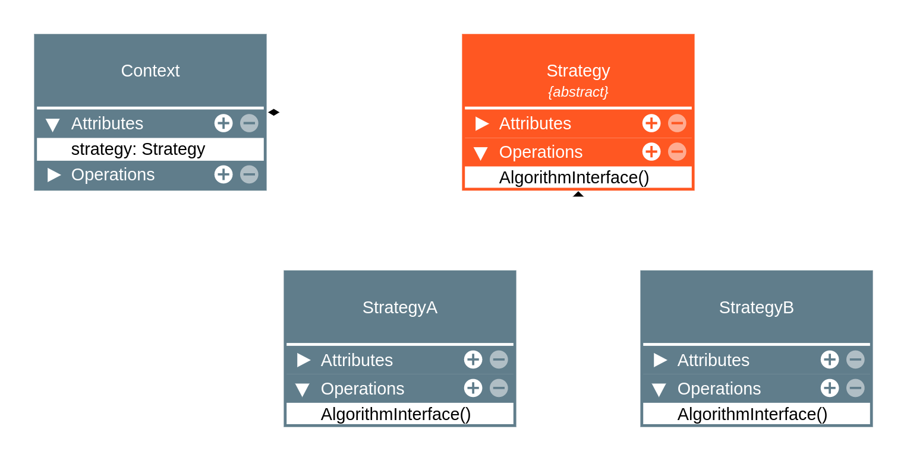

# Strategy
O design pattern Strategy é um dos padrões comportamentais mais conhecidos em engenharia de software. Ele permite que você defina uma família de algoritmos, encapsule cada um deles e os torne intercambiáveis. O Strategy permite que o algoritmo varie independentemente dos clientes que o utilizam.

### Estrutura do Padrão Strategy

O padrão Strategy envolve os seguintes componentes principais:

1. **Strategy (Estratégia)**: É uma interface comum para todos os algoritmos suportados. A interface declara métodos que cada algoritmo específico deve implementar.
2. **ConcreteStrategy (Estratégia Concreta)**: São implementações específicas da interface Strategy. Cada classe concreta implementa um algoritmo específico.
3. **Context (Contexto)**: Mantém uma referência a uma Strategy. O Contexto não sabe qual estratégia concreta está sendo usada, ele apenas chama o método da interface Strategy.

### Diagrama

Aqui está um diagrama simplificado do padrão Strategy:




### Exemplo de Implementação em Java

Abaixo está um exemplo de implementação do padrão Strategy em Java:

```java
// Interface Strategy
public interface Strategy {
    void execute();
}

// ConcreteStrategyA
public class ConcreteStrategyA implements Strategy {
    @Override
    public void execute() {
        System.out.println("Executing Strategy A");
    }
}

// ConcreteStrategyB
public class ConcreteStrategyB implements Strategy {
    @Override
    public void execute() {
        System.out.println("Executing Strategy B");
    }
}

// Context
public class Context {
    private Strategy strategy;

    public void setStrategy(Strategy strategy) {
        this.strategy = strategy;
    }

    public void executeStrategy() {
        strategy.execute();
    }
}

// Teste
public class StrategyPatternTest {
    public static void main(String[] args) {
        Context context = new Context();

        // Utiliza a estratégia A
        context.setStrategy(new ConcreteStrategyA());
        context.executeStrategy();

        // Utiliza a estratégia B
        context.setStrategy(new ConcreteStrategyB());
        context.executeStrategy();
    }
}
```

### Benefícios

1. **Fácil Substituição de Algoritmos**: Permite mudar o comportamento de um objeto em tempo de execução ao mudar a estratégia.
2. **Isolamento de Código**: Os algoritmos são isolados em suas próprias classes, facilitando a manutenção e o teste.
3. **Aumento da Flexibilidade**: Novos algoritmos podem ser adicionados sem modificar o contexto ou os outros algoritmos.

### Desvantagens

1. **Aumento do Número de Classes**: Pode aumentar significativamente o número de classes no seu programa.
2. **Complexidade**: Pode introduzir complexidade adicional devido à necessidade de gerenciar as estratégias e o contexto.

O padrão Strategy é uma excelente solução quando você precisa que diferentes algoritmos ou comportamentos sejam selecionados e executados em tempo de execução, fornecendo uma maneira flexível e extensível de realizar essa tarefa.